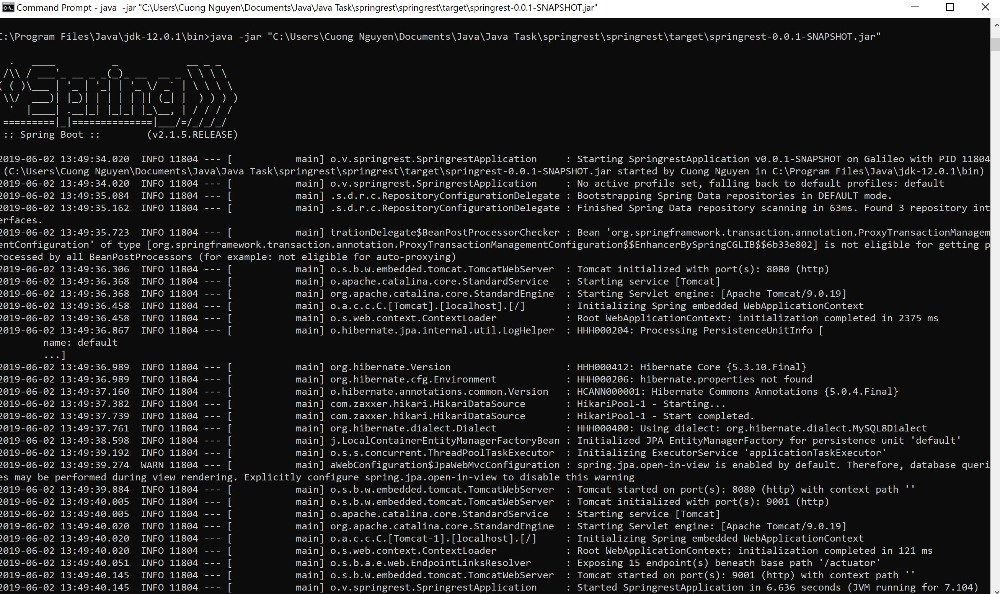
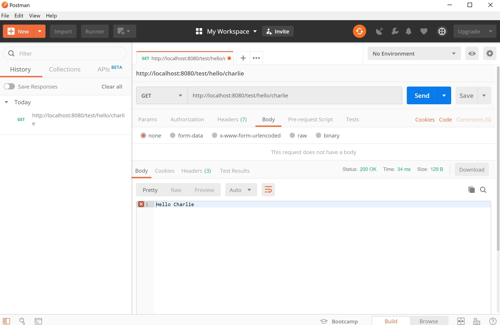
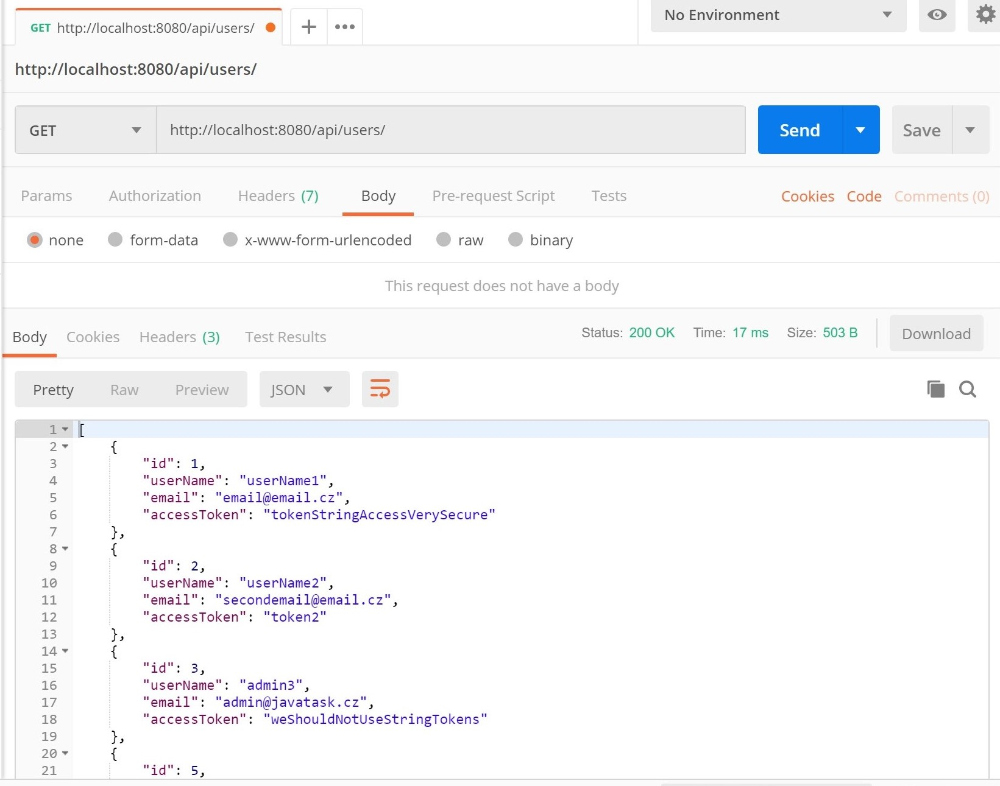
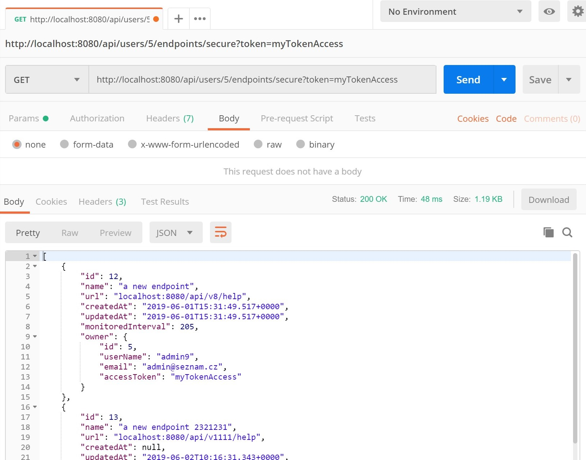
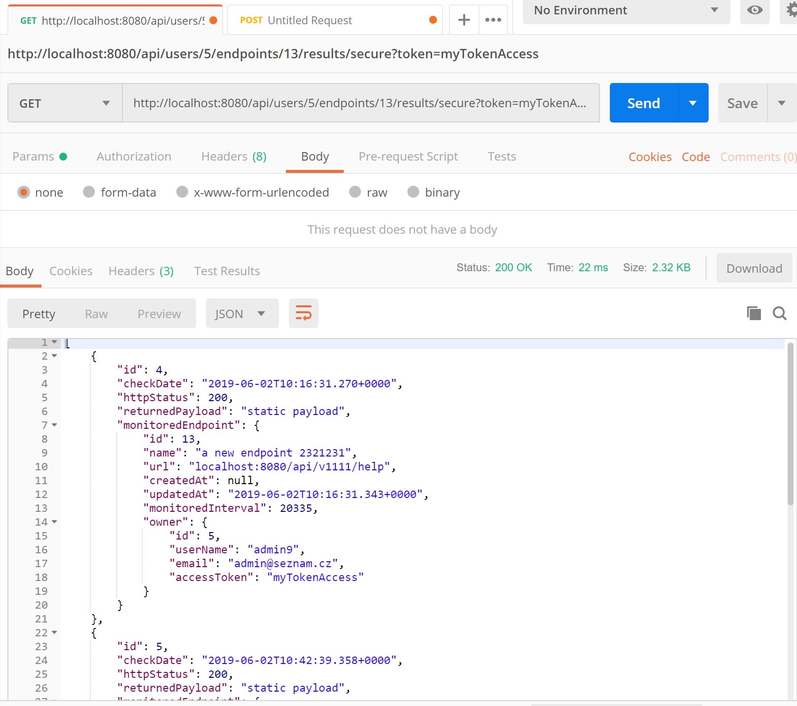
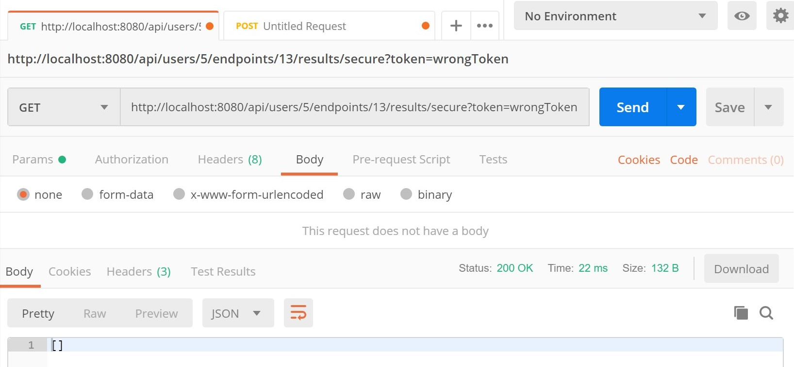

# Spring Booted Endpoints Monitoring Microservice
<h1> Monitored Endpoints Created in Spring Boot v2.1.5 </h1>

 This Spring Boot project was coded to provide a microservice application for monitoring URL endpoints.  
<b> 🍃 Dependencies: Web, JPA, Actuator, MySQL </b>

<h2> 🏃 Steps to run the Spring Boot Microservice REST API </h2>

1. Configure the MySQL Database using the "target/config/application.properties" file  
2. Navigate to the "target" folder containing "springrest-0.0.1-SNAPSHOT.jar"  
3. Run the following command:  

  `java -jar springrest-0.0.1-SNAPSHOT.jar --spring.config.location=<user directory path>\target\config\application.properties`

<b> Note: </b> the code was compiled with Java 12, hence, the JRE that you use must match the compiler version or it should be higher.

<h2> 📬 Examples using Postman: </h2>

1. Manually testing the server with a simple Hello:  

2. Get all users:  

3. Get all endpoints for user with an ID = 5, and token = myTokenAccess:  

4. Get all results for user with an ID = 5, endpointID = 13, and token = myTokenAccess:  

5. If the token is incorrect/invalid, then the server returns a blank:  

For more examples, refer to the "readmepics" folder.

  <h2> REST API Operations </h2>
  <h3> <li> User CRUD Requests </li> </h3>

| Method | Description | Endpoint |
| :---   |     :---:   |     ---: |
| GET | Returns all users | /api/users |
| GET | Returns a specific user of this {id} | /api/users/{id} |
| GET | Returns the first number of {n} users in a descending order | /api/users={n} |
| POST | Inserts a new user | /api/users |
| PUT | Updates a user by providing the specific {id} in the URI | /api/users/{id} |
| PUT | Updates a user by providing the specific ID in the JSON payload | /api/users |
| DELETE | Deletes a user by providing the specific {id} in the URI | /api/users/{id} |

<h3> <li> MonitoredEndpoints CRUD Requests </li> </h3>

| Method | Description | Endpoint |
| :---   |     :---:   |     ---: |
| GET | Returns all existing endpoints | /api/users/endpoints |
| GET | Returns a specific endpoint of this {id} | /api/users/endpoints/{id} |
| GET | Returns the first number of {n} users in a descending order | /api/users/endpoints={n} |
| GET | Returns all existing endpoints for a specific {userId} | /api/users/{userId}/endpoints |
| GET | Returns {n} number of endpoint for a specific {userId} | /api/users/{userId}/endpoints={n} |
| GET | Returns all the endpoints of an owner for a specified {userId} and the correctly provided {token} | /api/users/{userId}/endpoints/secure?token={token} |
| GET | Returns a specific endpoint of {id} for an owner of specified {userId} and the correctly provided {token} | /api/users/{userId}/endpoints/{id}/secure |
| POST | Inserts a new endpoint for a specified {userId} (MANY endpoints to ONE user relation applies) | /api/users/{userId}/endpoints |
| PUT | Updates an endpoint by providing the specific {id} in the URI along with {userId} | /api/users/{userId}/endpoints/{id} |
| PUT | Updates an endpoint by providing the specific ID in the JSON payload, however, the {userId} must be specified in the URI | /api/users/{userId}/endpoints |
| DELETE | Deletes an endpoint by providing the specific {id} in the URI | /api/users/endpoints/{id} |

<h3> <li> MonitoringResults CRUD Requests </li> </h3>

| Method | Description | Endpoint |
| :---   |     :---:   |     ---: |
| GET | Returns a specific result of {endpointId} for a given {userId} and a valid user access {token} in Query Params | /api/users/{userId}/endpoints/{endpointId}/results/secure?token={token} |
| GET | Returns all results for a given {userId} and a valid user access {token} in Query Params | /api/users/{userId}/endpoints/results/secure?token={token} |
| DELETE | Deletes a specific result of {id} given a valid user access {token}  | /api/users/endpoints/results/{id}/secure?token={token} |

<h3> <li> Spring Boot Actuator Requests (Runs on port 9001) </li> </h3>

| Method |  Endpoint |
| :---   |      ---: |
| GET | :9001/actuator |
| GET | :9001/actuator/httptrace |
| GET | :9001/actuator/health |
| GET | :9001/actuator/metrics |

<h2> 📜 Things that have been done so far... </h2>
<ul>
<li> ✔ User Model, Controller, Repository Interface, and Service </li>
<li> ✔ MonitoredEndpoints Model, Controller, Repository Interface, and Service </li>
<li> ✔ MonitoringResults Model, Controller, Repository Interface, and Service </li>
<li> ✔ Create a new "restapi" MySQL Database </li>
<li> ✔ Edit application.properties and connect to MySQL DB </li>
<li> ✔ Option to list a specified number of Users and EndPoints </li>
<li> ✔ Temporary String Token Authentication for GET requests </li>
<li> ✔ Auto generated ID values in models + auto generated Timestamps in MonitoredEndpoints </li>
<li> ✔ Enable Spring Actuator on port 9001 using context path => /actuator/ </li>
<li> ✔ Validated unique columns in Models for User and MonitoredEndpoints </li>
<li> ✔ Autowired MonitoringResultsService to MonitoredEndpointsController to log HTTP status codes on some requests </li>
<li> ✔ Compiled the first version into a .jar snapshot - "good enough for a demo but definitely not production" </li>
</ul>
<h2> 🔨 Things that still need to be done to successfully complete the given task: </h2>
<ol>
<li> Proper Authentication with JWT or OAuth (Current authentication is implemented using a very safe, certified, and harmless plaintext String method - i.e. not production-ready) </li>
<li> Write automated tests </li>
<li> Deprecate some endpoints that omit */secure/* -> this is not required by the task and populates the boiler plate code too much. Looks very ugly. </li>
<li> Finish this README file and format it nicely </li>
</ol>